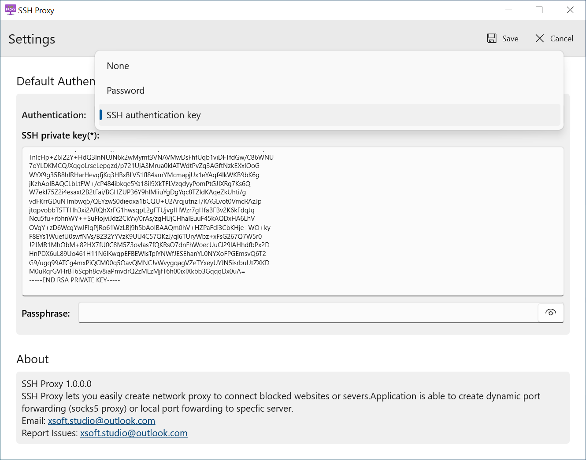

# SSH Proxy
**SSH Proxy** is applications help to create proxy or local port forwarding to access blocked websites and servers  over an encrypted SSH connection easily. It is able to create socks5 proxy (dynamic port forwarding) or local port forwarding to specific servers.
**SSH Proxy** is useful for transporting network data of services that use an unencrypted protocol, such as VNC or FTP , accessing geo-restricted content, or bypassing intermediate firewalls. Basically, you can forward any TCP port and tunnel the traffic over a secure SSH connection.

**SSH Proxy** features:
 - **Local Port Forwarding**. - Forwards a connection from the client host to the SSH server host and then to the destination host port.
 - **Dynamic Port Forwarding**. - Creates a SOCKS (socks5) proxy server that allows communication across a range of ports.

## Screenshots
<p align="center">
   
   
  
  
</p>


## Installation

[Visit Microsoft store websites](https://www.microsoft.com/store/apps/9P5GZB5N3WFR)  or Get it from Microsoft Store **ms-windows-store://pdp/?productid=9P5GZB5N3WFR**: 

<p align="center">
	<a href="https://www.microsoft.com/store/apps/9P5GZB5N3WFR">
		
	</a>
</p>


## Privacy

The application **SSH-Proxy** (now called application) is a migration appplication for web browsers. It simply helps to transfer all of browser data into new Windows device.

**What Data We Collect and Process:** The application **SSH-Proxy** does not collect, store or transit any personal personal data.
The app does not use any own telemetry functions apart from the standardised telemetry functions by Microsoft (crashes, install from which country, versions in use, custom events etc.)

## FAQ 
### What is the benifit of SSH Proxy?
**Answer:** SSH-Proxy creates a secure connection over encrypted SSH connection. It is the most safest way to access the blocked servers. 

### Can I create a proxy for my application from VPS such as Google Chrome, Firefox, Edge, etc ?
**Answer:** Yes. It really simple. 
1. Add your ssh public key to your VPS or your SSH server (optional)
2. In SSH Proxy application, create new dynamic port forwarding, using SSH key without passphrase is recommended.
3. Start the port forwrading when finished setup.
4. Now your proxy is available with `socks5://127.0.0.1:{your local port number}`
5. Depend on each application, there is a specific way to using proxy as bellow:
```bash
# Google chrome, Edge, Brave, or any based chromium browser
chrome.exe --proxy-server=socks5://127.0.0.1:{your local port number}
# Curl
curl -x socks5://127.0.0.1:{your local port number} https://your_target_website
```

###  Can I access blocked server with a specific port ?
**Answer:** Yes. local port forwarding does your job. Local port forwrading allows to create connection to access specific server with given port such as Mysql server, blocked SSH server, etc.
1. Add your ssh public key to your VPS or your SSH server (optional)
2. In SSH Proxy application, create new local port forwarding, using SSH key without passphrase is recommended.
3. Start the port forwrading when finished setup.
4. Now your connection is available on your local port, all messages from the local port are forwarded to the destination server on given port.
